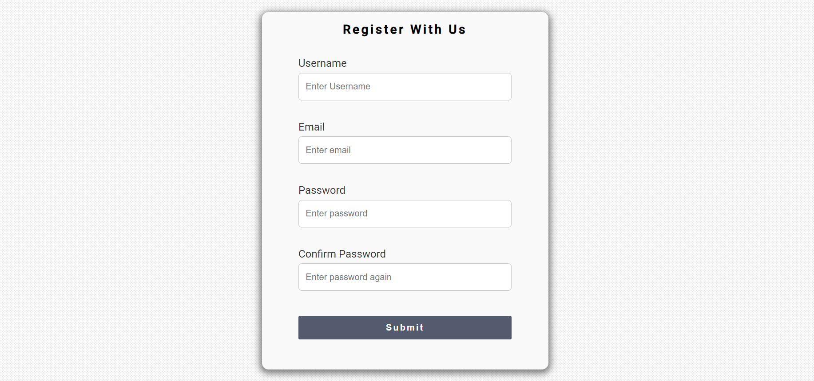

# VanillaJS Project - *RegisterWithUs*

> This project aims at validating user inputs. Success or Error
>  
> classes are added accordingly.

Find the project live [here](https://jawadsab.github.io/RegisterWithUs/)

This project was inspired by [Traversy Media](https://vanillawebprojects.com/)

